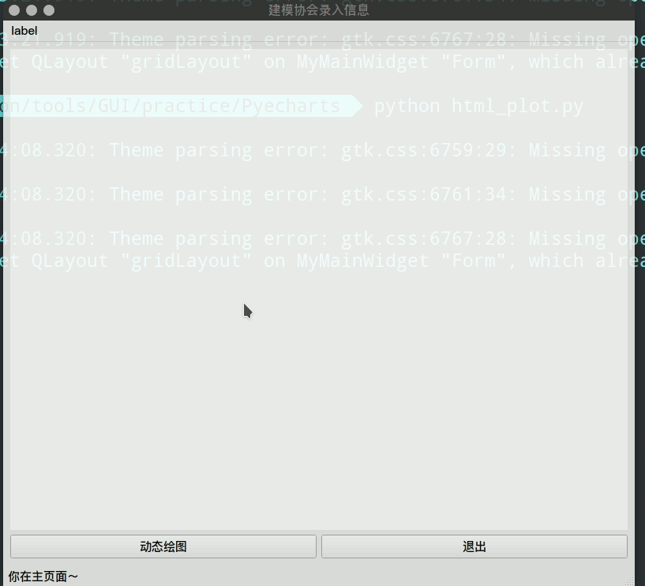
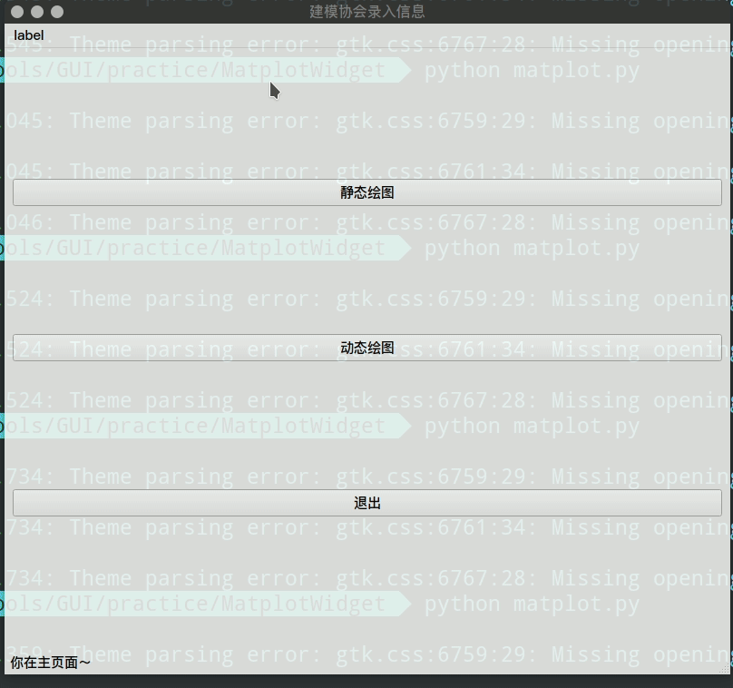
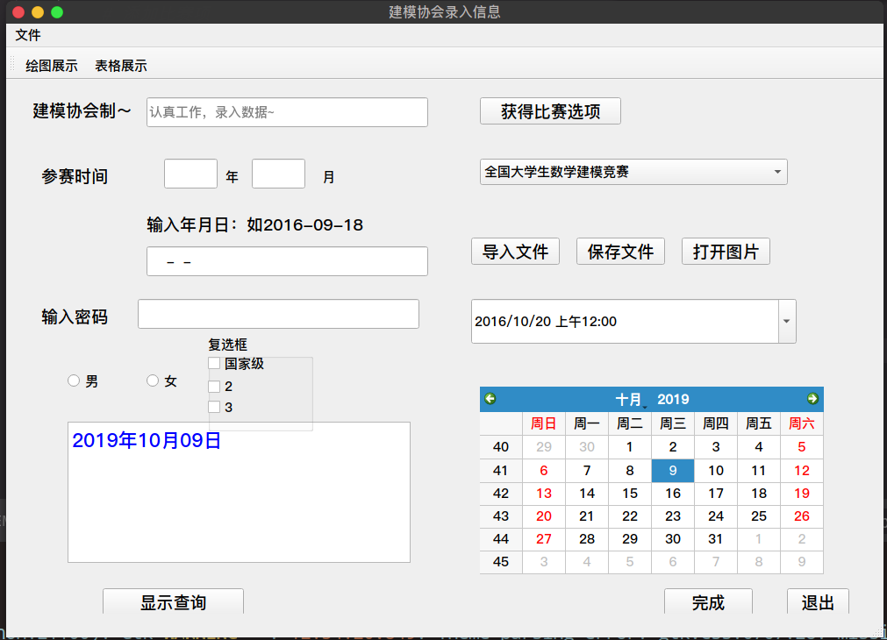

# Introduction

- The Basic-train floder: For basic window control exercises
- Example-project: A integrated application example

# Basic-train floder

- QtPandas: Using pyqt5's window to view and edit data with pandas. (Attention: pandas version 0.23 will be needed not the latest version)

- QSS: Using Qt style sheet to beautify the interface. (Suggestion: Using qss written by others, such as qdarkstyle)
- PyQtGraph: A simple and fast way to draw in a window.

- Pyecahrts: Integrating web page drawing in the window.

- MatplotWidget: Integrating Matplotlib to draw in the window.(more powerful)

- DataBase: Connecting database by pyqt. (Not recommended, it is recommended to connect to the database directly with python)
- BasicWin: Contains basic controls such as buttons, calendars, input boxes, comboBox, label, etc.(recommending learn it carefully)

- AdvanWin:
  - Container: tabwidget, listwidget to hold control
  - ViewWidget: To view and edit table conveniently, also can show result which from query of database.
  - WebPage: To load and show web page in a window.

# Example-project floder

Practical application of a basic knowledge.

`weather.py` is the same as `weather1.py`, except that `weather1.py` adds split window technology, which automatically drags the sub-window size.

`python weather1.py` can run it.

# Attention

Some `.py` file based on `.ui` file, the software qtdesigner can open and edit `.ui` file and generate `.py` file correspondingly.

So, don't change `.ui` file unless you know what you are doing.

#　Ｍore detailed description:

If you know chinese, the following website is a good choice.

About basic and advanced control(tabwidget and button, etc.): https://muyuuuu.github.io/2019/10/06/pyqt5-basic/

Matplotlib, qtpandas, database, etc: https://muyuuuu.github.io/2019/10/11/pyqt-pit/

Layout and beautify window: https://muyuuuu.github.io/2019/10/19/pyqt-layout/

A beautiful and applicable interface: https://github.com/muyuuuu/A-Beautiful-PyQt5-Interface

